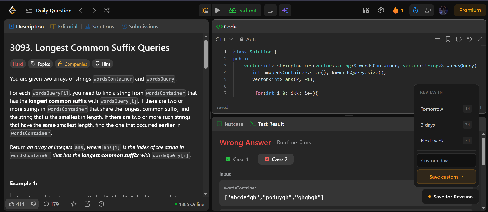
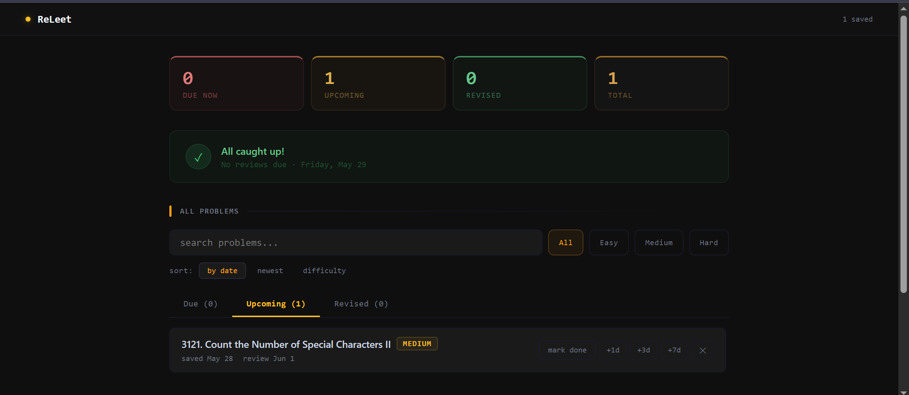
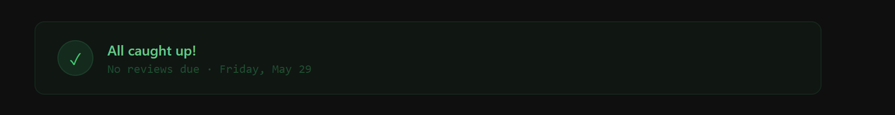
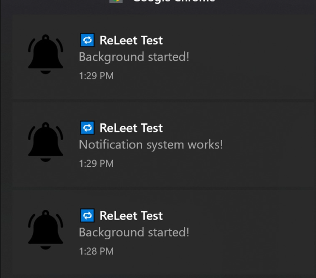

# ReLeet

A Chrome extension that helps you remember and revisit failed LeetCode problems using scheduled reviews.

Instead of forgetting a problem after solving it once, ReLeet creates a lightweight review system directly inside your coding workflow.

---

## Why ReLeet?

Many developers solve a LeetCode problem once and never revisit it.

A few weeks later:

- The approach is forgotten
- Edge cases are forgotten
- Patterns are forgotten

ReLeet solves this by allowing you to save difficult problems and schedule future reviews.

---

## Features

### Save Failed Problems

Save any LeetCode problem directly from the problem page.



---

### Review Dashboard

Track all saved problems in one place.

- Due problems
- Upcoming reviews
- Revised problems
- Total saved problems



---

### Review Today

Focus only on problems that require attention today.

- Due today
- Overdue reviews
- Progress tracking



---

### Smart Scheduling

Choose when to revisit a problem:

- 1 Day
- 3 Days
- 7 Days
- Custom Schedule

---

### Snooze Reviews

Not ready yet?

Quickly postpone reviews:

- +1 Day
- +3 Days
- +7 Days

---

### Chrome Notifications

Receive reminders when reviews become due.



---

### Search, Filter and Sort

Quickly find problems by:

- Name
- Difficulty
- Review status
- Date

---

## Tech Stack

- React
- TypeScript
- Chrome Extension APIs
- Chrome Storage API
- Chrome Notifications API
- Vite

---

## Installation

### Option 1 Clone Repository (For Developers)

```bash
git clone https://github.com/itisrudraa/releet.git
cd ReLeet
```

### Install Dependencies

```bash
npm install
```

### Build Extension

```bash
npm run build
```

### Load Into Chrome

1. Open Chrome
2. Visit:

```text
chrome://extensions
```

3. Enable Developer Mode
4. Click Load Unpacked
5. Select the build folder

### Option 2 (Recommended)

1. Download the latest release from the GitHub Releases page.
2. Extract the ZIP file.
3. Open Chrome and visit:

```text
chrome://extensions
```

4. Enable Developer Mode.
5. Click Load unpacked.
6. Select the extracted ReLeet folder.

Done 🎉

---

## Project Structure

```text
ReLeet
├── Dashboard
├── Notification System
├── Scheduling System
├── Chrome Storage
└── LeetCode Integration
```

---

## Roadmap

### v1.0

- Save failed problems
- Dashboard
- Notifications
- Scheduling
- Snooze system
- Search and filters

### Future Versions

- True spaced repetition
- Review streaks
- Analytics dashboard
- Review history
- Performance insights
- Sync across devices

---

## Motivation

I built ReLeet because I kept forgetting problems I had already solved.

What started as a small personal tool became a Chrome extension that helped me build better review habits while preparing for coding interviews.

---

## Author

Rudra

GitHub:
https://github.com/itisrudraa

LinkedIn:
https://www.linkedin.com/in/itisrudra/

---

## License

MIT License